# OSPF with FRRouting and Docker Lab Report
## Software Requirement
In this report, I documented how I built OSPF network and performed network experiments under Ubuntu 16.04 system. The following software suites are used:
* FRRouting. 
 * [Installation from source]("http://docs.frrouting.org/en/latest/installation.html#from-packages")
 * [Image from cumulusnetworks]("https://hub.docker.com/r/cumulusnetworks/frrouting")
* Docker containers. 
 * [Installation]("https://docs.docker.com/install/linux/docker-ce/ubuntu/")

## TASK 1
Create the following topology and run ospf 
 
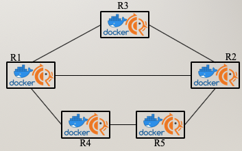
 
And for each container, show 
* ospf neighbors
* ospf routes
* ip routes 
 
And then, show you can successfully,  
* R1 ping R2
* R4 ping R2

### FRR1
#### OSPF Neighbors
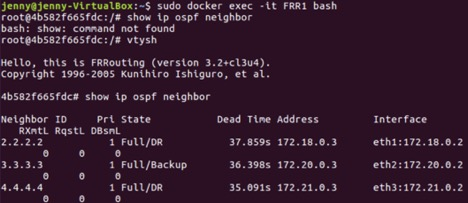

#### OSPF Routes
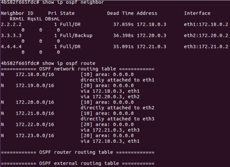

#### IP Routes
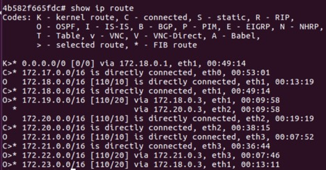

### FRR2
#### OSPF Neighbors
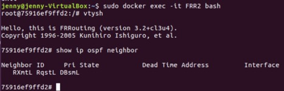

#### OSPF Routes
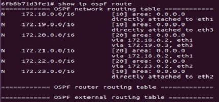

#### IP Routes
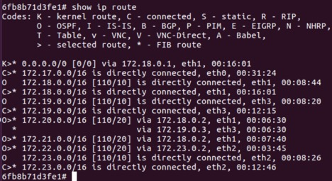

### FRR3
#### OSPF Neighbors
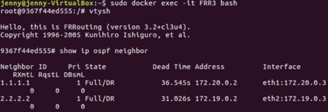

#### OSPF Routes
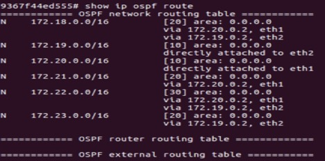

#### IP Routes
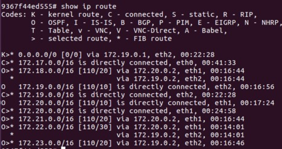

### FRR4
#### OSPF Neighbors
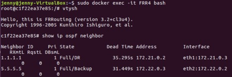

#### OSPF Routes
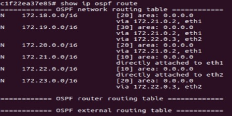

#### IP Routes
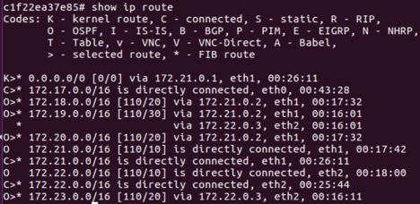

### FRR5
#### OSPF Neighbors
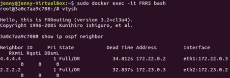

#### OSPF Routes
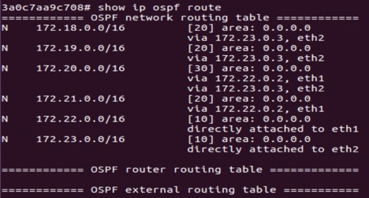

#### IP Routes
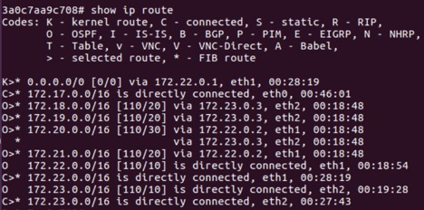

### R1 ping R2
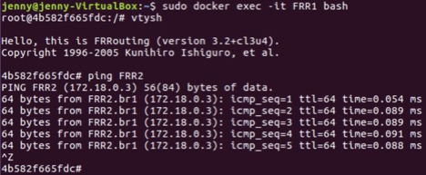

### R4 ping R2
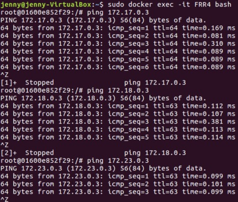

## TASK2
Create the following topology and run ospf with link cost
 
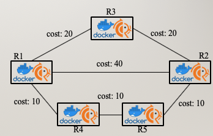
 
And for each container, show 
* ospf neighbors
* ospf routes
* ip routes 
 
And then, show you can successfully,  
* R1 ping R2
* R4 ping R2

### FRR1
#### OSPF Neighbors
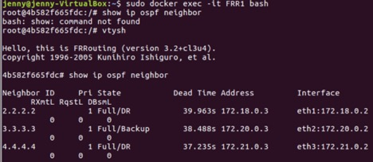

#### OSPF Routes
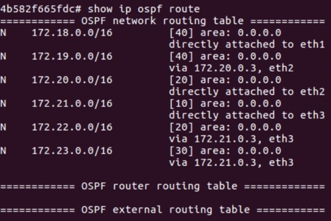

#### IP Routes
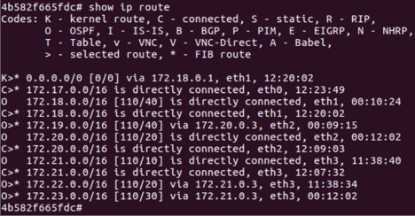

### FRR2
#### OSPF Neighbors
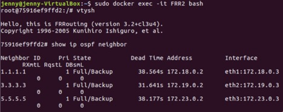

#### OSPF Routes
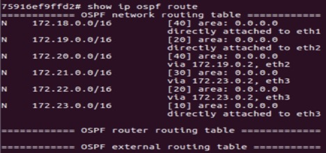

#### IP Routes
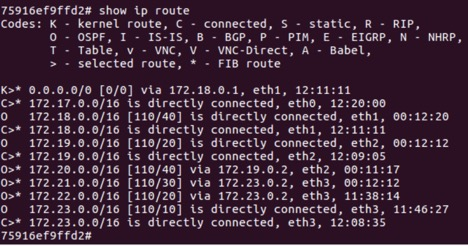

### FRR3
#### OSPF Neighbors

#### OSPF Routes
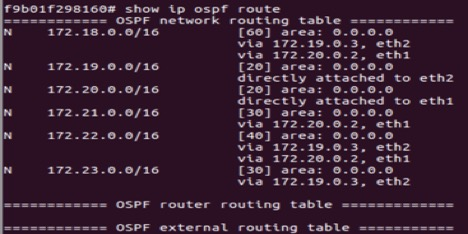

#### IP Routes
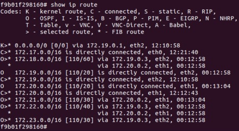

### FRR4
#### OSPF Neighbors
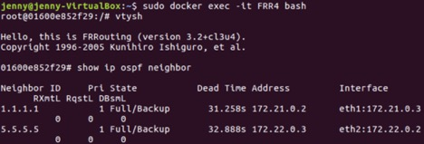

#### OSPF Routes

#### IP Routes
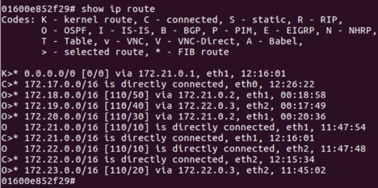

### FRR5
#### OSPF Neighbors
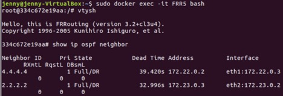

#### OSPF Routes
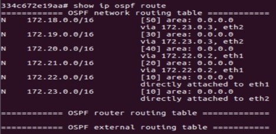

#### IP Routes
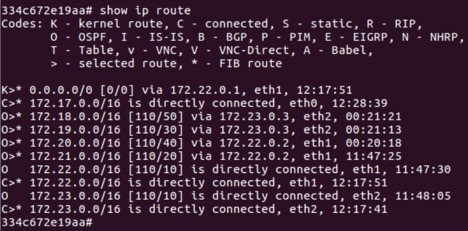

### R1 ping R2
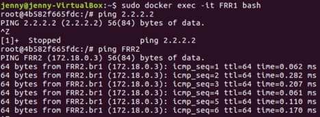

### R4 ping R2
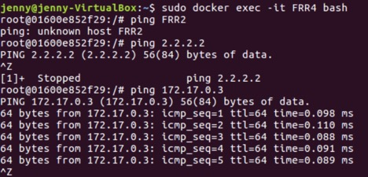

## TASK 3
Create the following topology and run ospf 
First, send UDP iperf traffic from R1 to R2 
Then, capture UDP packet to R2 using *tcpdump* 
 
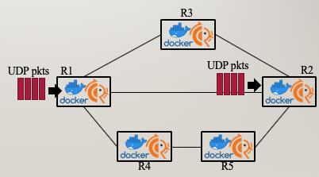
 
### TASK 3 - Part 1
And then, create the following topology and run ospf. While sending UDP packets, break the line R1-R2. 
 
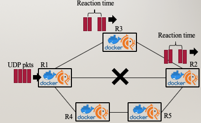
 
### TASK3 - PART 2
Create the following topology and run ospf
 
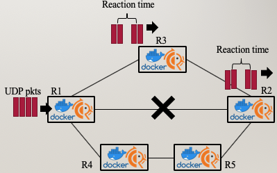
 
#### Use Tcpdump to show UDP packets take a different path
We did this by analyzing the tcpdump capture and find the reaction time using Wireshark
 
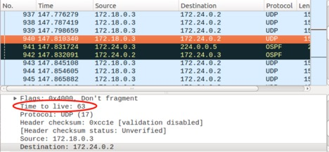
 
 
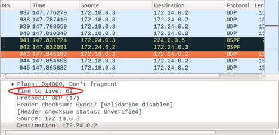
 
### TASK3 - PART 3
Create the follsowing topology and run ospf. Then break another link R3-R2 and repeat the same analysis
 
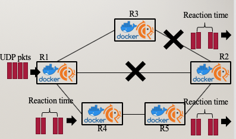
 
#### Use Tcpdump to show UDP packets take a different path
We did this by analyzing the tcpdump capture and find the reaction time using Wireshark
 
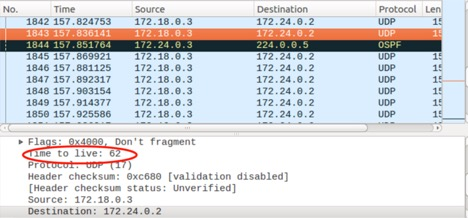
 
 

 

