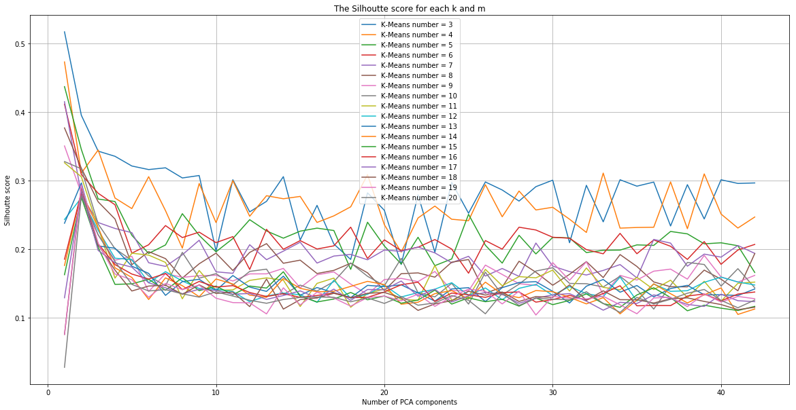

# Revised K-means Clustering on Two-Dimensional Taxi Trajectory Data
This is a case study I did as the interview for <a href="https://ucomp.net/">Urban Complexity Lab</a> I later worked for. The corresponding jupyter notebook with full discussion can be found <a href="https://github.com/hhongjiang/hhongjiang.github.io/blob/master/trajectory-clustering/display/trajectory_clustering_challenge_solution.ipynb">here</a>. 
## Task
In the question <a href="https://github.com/hhongjiang/hhongjiang.github.io/blob/master/trajectory-clustering/display/README.md">description</a>, candidates are required to finish the following tasks on the given raw GPS trajectory dataset: 
 
I. Preprocess and apply uniform timescale (linear interpolation to create checkpoints).  
II. Test K-means clustering on the data with different cluster number *k* to find the optimal one with highest Silhoutte score. 
III. Perform Gaussian Mixture clustering using this optimal cluster number, visualize the result and detect outliers with less than 0.2% likelihood.  
## Challenge
The major challenge is that the *python-sklearn-KMeans* module is built for vector data, but here in this task we have tensor data {longtitude, lantitude, time}. I proposed two alternative solutions, averaged Silhoutte score and tensor flattening. To avoid the possible problems with high-dimensionality in K-means, PCA with *m* components is also used to reduce dimensionality. 
 

 
## Acceleration
To boost time performance, I used *sklearn.MiniBatchKMeans* instead of *KMeans*, which means that the most computationally costly step is conducted on only a random sample of observations as opposed to all observations. Through experiments, I found that *MinibatchKMeans* gives the same parameter result as *KMeans*, while it's much faster than *KMeans*. And *sklearn.pipeline.Pipeline* is used to make the parameter selection code more readable.  
## Limitation
I also discussed the limitation of the designated appoarches in this challenge. First of all, K-means doesn't consider uncertainty. Secondly, K-Means places a circle (or hyper-spehere at high dimension) at the center of each cluster. But sometimes clusters in real-world data are not circular, thus applying K-means directly might result in a poor fit. In the meantime, GMM is capable of finding a smooth Gaussian model rather than a hard-edged sphere. 
 
Additionally, In this task we basicly rely on Euclidean distances to measure the similarity. However, this method strictly calculate the distance in each checkpoints. Thus it's very sensitive to noise.  
## Alternatives
More reasonale choices include: 
 
- Partiion trajectories into sub-trajecotries, and each of them is represented by a Minimum Bounding Rectangle(MBR), which is an expression of the maximum extents of a 2-dimensional object. The query processing is then based on these MBRs, instead of scanning data elements of an entire trajectory.(Lee S, Chun S, Kim D, et al.,2000) 
- Longest common sub-sequence, LCSS.(M. Vlachos, G. Kollios, and D. Gunopulos,2002) 
 
Finally, the result of outlier detection by ranking the Gaussian Mixture Model likelihood is shown below: 
 

